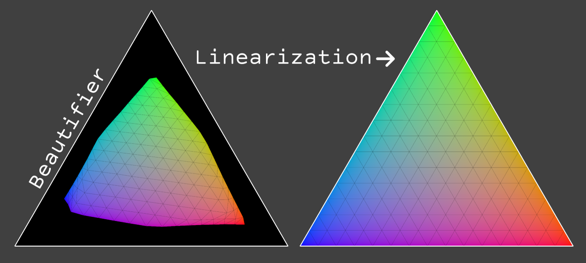
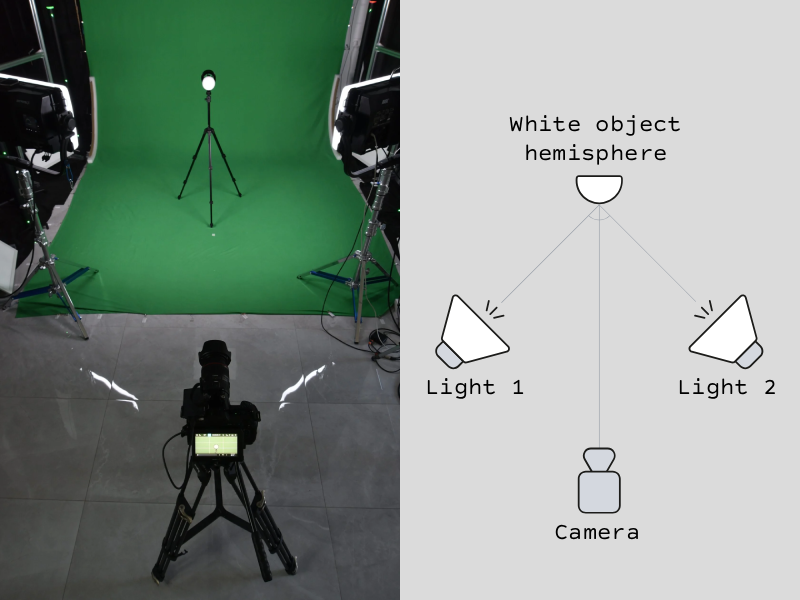
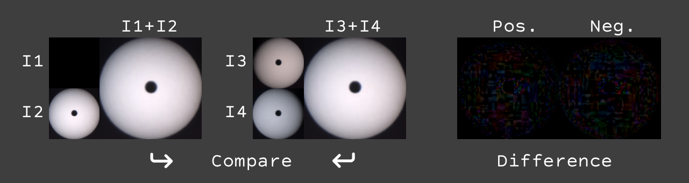
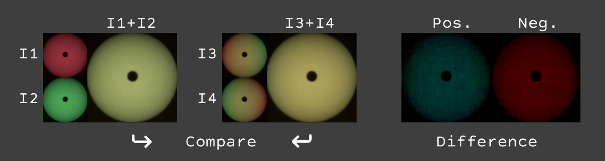
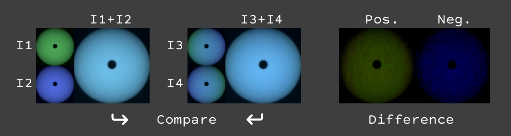
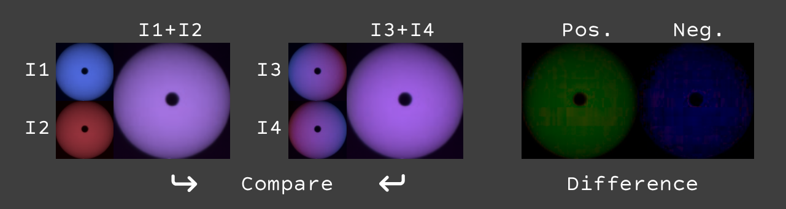
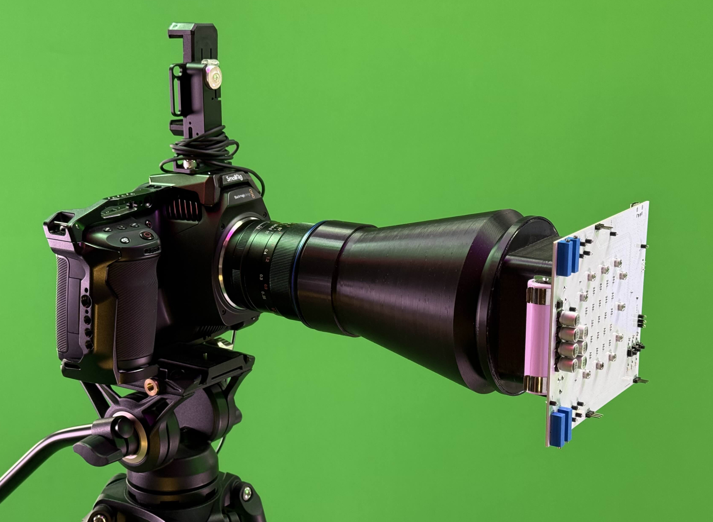
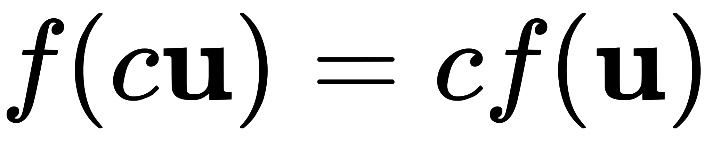
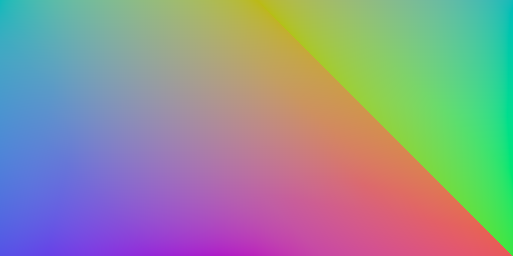
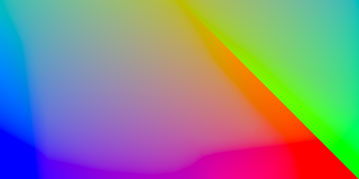

# Cinema Camera Beautifiers

This study is focused on exploring nonlinear gamut transforms done by cinema cameras. Such transforms make images non-linear and damage most of the techniques in virtual production such as keying, lighting calibration and LED wall to camera matching. Since these transforms are not publicly documented, the goal is to reverse-engineer them. The article describes the methodology of measuring, canceling and re-applying such transforms.

## Known approach to linearization.
Cinema camera raw profiles are packed with transfer functions. To make an image linear, we have to apply the inverse transfer function to the image. 
Those transfer functions are publicly documented for most cameras.

Here are some references:
- [SLog3](TransferFunctions/SLog3_SGamut3Cine_SGamut3.pdf)
- [ARRI LogC4](TransferFunctions/ARRI_LogC4.pdf)
- [Blackmagic Film Gen 5](TransferFunctions/BlackmagicGen5.pdf)

However, it turns out that the transfer function is not the only non-linear operation done by cinema cameras. There is also a **nonlinear gamut transform** happening in the camera before the transfer function is applied. So the pipeline looks like this:

`Sensor data (linear)` ->  `Gamut transform (non-linear)` ->  `Transfer function (non-linear)`  ->  `Encoded image`

## What is gamut nonlinearity?
Since light is additive, every mixture of two arbitrary colors must lay on a straight line between those colors. However, due to gamut nonlinearity, those mixtures are bent away from the straight line.
In simple words, **Half-Yellow**(0.5 0.5 0) will not lay between **Red**(1 0 0) and **Green**(0 1 0). There is a reason why this nonlinear gamut transform exists, but that is a topic for another article.

## Naming
Since I failed to find any established term for this transformation, I will call it **Beautifier** as we call it internally at [Antilatency](https://antilatency.com). The inverse operation will be accordingly called **Debeautifier**. This kind of naming addresses the fact that this transform is artistic color grading; there is no single "correct" way to do it.
Sometimes this phenomenon is referred to as **gamut compression**. However, I would prefer not to blur the meaning of that term, since it currently describes a transformation with a specific mathematical form — unlike the more **arbitrary transformations** applied inside cameras.
Later in this article, the shape of this transform will be shown, and it will become clear that it is not a simple gamut compression.

## Why should we care about it?
Virtual production is a set of mathematical operations. Any mathematical operation becomes invalid once artistic color grading is applied.
As I mentioned, **Beautifier** has its role, but it should be applied after all mathematical operations (e.g., keying, lighting calibration, display-to-camera mapping) are completed, **at the end of the pipeline**.
Otherwise, those operations will produce incorrect results. 

If the camera footage is the end of the pipeline or is followed by artistic color grading only, then Beautifier can be applied in-camera. In **Virtual production**, however, camera **footage is the input** of the pipeline, so it is critical **not to apply Beautifier** at this stage, or to ensure it can be undone.

Several teams around the world have already found this problem while working in virtual production.

### OpenVPCal @ Netflix
[OpenVPCal](https://github.com/Netflix/OpenVPCal) is an open-source tool for camera and LED wall calibration in virtual production. The goal of the toolset is to be able to accurately predict a color captured by a camera from a color sent to a LED wall. 
In [this presentation](https://youtu.be/viFi5_wRqvc?t=546), the author explains a method to achieve better calibration results by using **desaturated color patches** for calibration. One of the reasons for that they mention is 
>Camera’s internal calibration might “bend” highly saturated colours “by design”.

### Cybergaffer @ Antilatency
The first time I encountered this problem was during the [Cybergaffer](https://cybergaffer.com) project, where accurate lighting calibration was required. During calibration, the software captures a reference white sphere illuminated by different light fixtures (per channel). The goal of the algorithm is to be able to predict the color of the sphere under any combination of lighting parameters. This is required to solve the inverse problem - to calculate lighting parameters for any given target illumination and configure physical lights accordingly.
Independently, we found the same symptoms as the Netflix team did, and came to the same solution - to **mix a portion of white LED** into R,G,B LEDs to desaturate colors during the calibration, and later reconstruct the original saturated colors.

The problems with that approach are:
- We never know how much desaturation is enough to avoid nonlinearity problems.
- Desaturation reduces the determinant of the matrix, bringing the matrix axes closer to a collinear state. The smaller the determinant, the more noise and measurement inaccuracies will affect the calibration result, since to recover the original primaries from desaturated color patches, we need to multiply them by the inverted matrix. So we should be careful not to desaturate colors too much.
- **This approach does not solve the problem.**

That is a good hack though, and later in this article I will explain why it works for some colors.

## How can you spot gamut nonlinearity at home?
<!-- ## How to find this nonlinearity with a simple experiment? -->
<!-- The **Two Lights Experiment** relies on the fact that light is additive. So to get an image of a scene illuminated by two lights, we can sum images of each light on separately.  -->
The **Two Lights Experiment** relies on the fact that light is additive. Therefore, for a truly linear camera, the photo of a scene illuminated **by both lights** must be **equal** to the per-pixel **sum of images** of the scene illuminated **by each light separately**. We can use this knowledge to check whether a camera is linear or not. The experiments can be done with minimal equipment.

You will need:
- A cinema camera
- 2 RGB lights
- White object of any shape

First lets capture 4 images (I1, I2, I3, I4), setting lights to one of two colors (states) as shown in the table below.

| Image |          Light 1 |          Light 2 |
|-------|------------------|------------------|
|   I1  |   Black          |    Black         |
|   I2  |   White          |    White         |
|   I3  |   Black          |    White         |
|   I4  |   White          |    Black         |

Then we remove transfer function from those images, compute the two sums: `I1+I2` and `I3+I4`, and compare them. If the camera were linear, those sums would be equal. Non-zero difference indicates nonlinearity.

As expected, the difference is very small (noise scale). That means that mixtures of black and white are **linear**.

Now, let's select another color pair for the next experiment: Red and Green.
So our 4 images in this experiment are:

| Image |   Light 1        | Light 2          |
|-------|------------------|------------------|
|   I1  |   Red            |    Red           |
|   I2  |   Green          |    Green         |
|   I3  |   Red            |    Green         |
|   I4  |   Green          |    Red           |

**Results for Red-Green:**

As we can see, there is a significant difference between those sums. That means that mixtures of Red and Green are **nonlinear**. 

We can perform the same experiment for other color pairs as well.

**Green-Blue:**

**Blue-Red:**

The same nonlinearity is observed there as well.

That experiment shows that the camera images are *linear along brightness*, but *nonlinear across gamut plane*.

## Measuring and isolating gamut nonlinearity
The experiment above can only show that nonlinearity exists, but does not provide enough data to measure and reverse-engineer it. In order to do that, we've designed a measurement device that is able to precisely display linear colors. This device is based on RGB LEDs with excellent voltage stability and state-of-the-art PWM control.

This device is able to display temperature-balanced color sequences with high accuracy, allowing us to probe the camera's response to various color stimuli.



Here is a calibration sequence fragment. The central area shows the color to be averaged later to reduce noise; four dots at the corners act as reference points for alignment and as a strobe to split the sequence into samples.

A 12-minute-long calibration video contains 16x16x16=4096 color samples covering the entire RGB cube uniformly.

Here is the measured data:



First, let's remove transfer function.



As you can see in that plot, there are two transformations still present:
1. Matrix3x3 transform that is responsible for brightness, color balance and linear gamut shaping.
2. Some other nonlinear transform

Let's remove Matrix3x3 transform as well.
This let us see only nonlinear transform. We will restore Matrix3x3 later in order to keep brightness and color balance and gamut unchanged.


This plot is **Beautifier** alone.


## What is the general form of the Beautifier function?
From the **Two Lights Experiment** we already know that all colors between black and white are linear. That means that we are looking for a function that does not change linearity between those colors.
Additionally, we can perform several more experiments for black-somecolor mixtures, and confirm that those mixtures are also linear.

That leads us to the conclusion that the function we are looking for is [Homogeneous function](https://en.wikipedia.org/wiki/Homogeneous_function).

  

That means that if we scale input color by some factor and apply the function, it is equivalent to applying the function first and then scaling output by the same factor.

## Visualizing homogeneous transform
To visualize homogeneous transform, we can slice RGB cube by plane passing through red, green and blue points of the cube. Any distortion of that triangle will represent distortion of the whole cube, because all other colors are laying on scaled versions of this triangle.

To get such slice, we can select samples where indices R+G+B=15 (our cube is 16x16x16 samples).
Since all slices are similarly distorted, we can select any slice, but slice №15 has the highest resolution.


White triangle on that plot represents undistorted slice.

If you look closely at the shape of the distortion, you can notice that near the center (that represents less saturated colors) there is no distortion at all. This explains why the **desaturation trick** works and why it doesn't. Using desaturated colors we can find 3x3 matrix that will work well for central region of colors, but as soon as we move to more saturated colors, the distortion becomes significant and matrix approximation fails.

## In what way can these distortions be represented?
As we can see from the plot above, this distortion is unlike any smooth function such as polynomial or spline. It has almost undistorted area in the center, with significantly distorted areas near the edges. Thus the best way to represent it is using a LUT-based approach. Technically, we can use 3D LUT for that, but the problem of 3D LUT is that resolution of 3D LUT decreases with brightness. If 3D LUT has size 33x33x33 it has 32 steps between red(1,0,0) and green(0,1,0), but only 8 steps between dark-red(0.25,0,0) and dark-green(0,0.25,0). Another problem is memory consumption, for instance, to have 512 steps between red and green, we will need 512x512x512 = 134 million samples, that will take more than 1.6 GB of memory in binary form, and much more in text form.

Instead, we can invent a new type of LUT that is based on homogeneous coordinates. Such LUT will have constant resolution across brightness levels, and will require much less memory.

## Introducing 2D LUT
To have 512 steps between red and green, it uses 1.6Mb (not GB) of memory and has constant resolution across brightness levels. It can be stored as a simple 2D image. Since the shape of the discibed space is a triangle, we can pack it into a rectangle by cutting off a corner and flipping it.

If we display the gammut transform for the camera I used for this article as 2D LUT, it looks like this:

**Beautifier**

**Debeautifier** (linearizer)

Important property of 2D LUT is that it a superset of Matrix3x3 transform. Any Matrix3x3 can be represented as a 2D LUT. The smallest 2D LUT of 3 pixels is actually a Matrix3x3 multiplication.

Previously, I mentioned that we removed Matrix3x3 transform to visualize Beautifier alone.
Since 2D LUT includes Matrix3x3, we can represent 2DLUT and Matrix3x3 transform together as a single 2D LUT.

Here is the result of removing Beautifier from the original footage.



And here is the result of removing Beautifier without restoring native color balance and brightness (Matrix3x3).



There are still some minor defects, and that is probably due to lack of resolution of measurements.
As further increasing the measurement resolution would take too long to capture, the next step is to implement a hybrid measurement sequence with a basic resolution across the entire cube and a high resolution on the `r+g+b=1` plane.

## How Virtual Production pipeline should look like?

### ..for LED wall
- Get video from camera (beautified, packed with transfer function)
- Remove transfer function
- Remove Beautifier (apply Debeautifier)
- Calculate and apply Matrix3x3 to match LED wall primaries
In this stage of the pipeline any value sent to LED wall will be captured by camera with the same value. Of course, the display should be lenear.
- Re-apply Beautifier on post if needed.

### ..for chroma keying
- Get video from camera (beautified, packed with transfer function)
- Remove transfer function
- Remove Beautifier (apply Debeautifier)
- Apply keying algorithm in linear space
- Composite foreground with linear background
- Re-apply Beautifier on post if needed.

Important note: When we re-apply Beautifier at the last stage, we can use a Beautifier from a different camera! As long as these cameras share sensitivity spectrums and primaries are alligned (using matrix3x3 transform).

## I hope that this research will be obsolete one day
Ideally, all cinema cameras should provide an option to disable Beautifier in-camera, so virtual production teams can get linear footage directly from the camera without the need to reverse-engineer those transforms. Also, it would be great to have vendor-provided beautifiers to be able to re-apply them to keep the original look.

Today we can see some steps in that direction. For instance, Blackmagic Design provides (since BRAW SDK Beta 3) an option to disable Gammut compresstion in BRAW SDK. BRAW format stores footage very close to sensor data and apply Beautifier on the unpacking stage. Since version Beta 3, it is possible to disable that step and get footage without Beautifier applied. See [BlackmagicRAW-SDK.pdf](https://documents.blackmagicdesign.com/DeveloperManuals/BlackmagicRAW-SDK.pdf) page 24.
However, this does not help yet to get unbeautified video via HDMI/SDI outputs, required for virtual production. Moreover, to keep original color grading of the camera, we need a way to re-apply Beautifier after all virtual production operations are done, which is still not possible.

## Dear color management system developers
It would be great if there were a standard way to describe Beautifier/Debeautifier transforms, implemented in popular color management systems such as ACES, OpenColorIO, etc.

